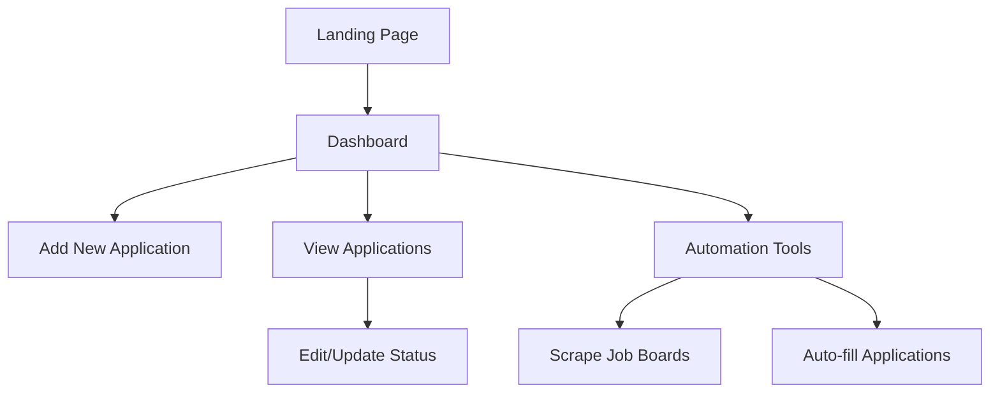

# JobTrackr Development Plan

## 1. Planning Phase

### a. Core Features:

#### Job Application Tracker:
- Add/Edit/Delete job entries
- Track application status (applied, interview, rejected, etc.)
- Company details, position, salary, etc.
- Application deadline reminders

#### Automation Features:
- LinkedIn/EasyApply automation
- Resume/Cover letter tailoring
- Auto-fill application forms
- Job board scraping/aggregation

### b. Tech Stack Considerations:
- **Frontend**: React/Vue.js (for complex UIs) or vanilla HTML/CSS/JS
- **Backend**: Node.js/Express, Python/Flask (if you need server-side processing)
- **Database**: SQLite (simple), PostgreSQL/MongoDB (more complex)
- **Browser Automation**: Puppeteer/Playwright
- **APIs**: LinkedIn API (with caution), Indeed API, etc.

## 2. Design Phase

### a. User Experience (UX) Flow:

### b. UI Wireframing (Key Screens):
- Dashboard View (Calendar + Application Stats)
- Application Form (Add/Edit)
- Automation Control Panel
- Reporting/Analytics

### c. Responsive Design Considerations:
- Mobile-first approach for quick access
- Data tables that work well on all devices
- Accessible color schemes and font sizes

## 3. Incremental Development Approach

### Phase 1: Basic Tracker 

- CRUD operations for job applications
- Simple dashboard with stats
- Local storage or basic database

### Phase 2: Automation Foundations 

- Job board scraping
- Basic form auto-fill
- Chrome extension (if needed)

### Phase 3: Advanced Features 

- LinkedIn integration
- AI-assisted cover letters
- Advanced analytics